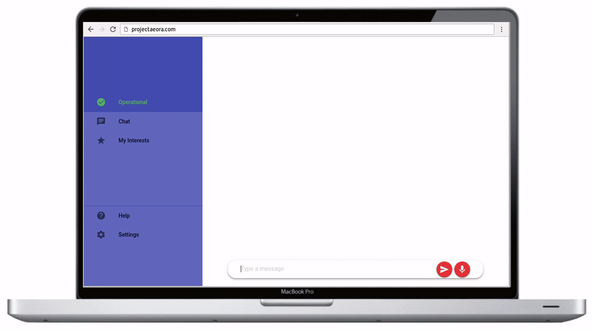

# Context-based Question-Answering

**A context based question answering system developed as part of the Bachelor's Thesis.**

## Installation
Install all the dependencies using the command:

    pip3 install -r requirements.txt

This is a Django project therefore the command you need to run it is:

    python3 manage.py runserver

Note: You will need to download spacy models to run the code as-is:

    python -m 

Interface based on the chatbot developed by [Alex Motoc](https://github.com/alexmotoc).